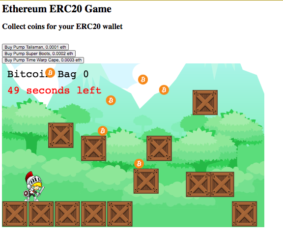

### Requirements

Node 8.11.4

Truffle 5.0.1

### Commands

Start simple server (from frontend folder)

    python -m SimpleHTTPServer 8000

Fire up a local ethereum node (from solidity folder)

        truffle develop

### Migrates (from inside the erc-1155 folder)
1. migrate gametoken contract
2. migrate marketplace contract
3. migrate contract that creates the 3 game tokens

    truffle develop
    migrate --reset

    get balance of token 1 that is owned by the market place contract
     (await GameToken.at("0x85B55e6f144F1e7c83557c630Af0b3DE3cA12c5E")).balanceOf("0x6638d3523201bF99112d56966125B09dAe412a4C",1).then(bn => bn.toNumber())

    get creator account of Token 1
    (await GameToken.at("0x85B55e6f144F1e7c83557c630Af0b3DE3cA12c5E")).creators(1)

    Deploy to ropsten:

        truffle migrate --network ropsten   [--reset]

        ➜  erc-1155 git:(master) ✗ truffle migrate --network ropsten
            You can improve web3's peformance when running Node.js versions older than 10.5.0 by installing the (deprecated) scrypt package in your project

            Compiling your contracts...
            ===========================
            > Everything is up to date, there is nothing to compile.

            Starting migrations...
            ======================
            > Network name:    'ropsten'
            > Network id:      3
            > Block gas limit: 0x7a1200

            1_initial_migration.js
            ======================

               Deploying 'Migrations'
               ----------------------
               > transaction hash:    0x6d7e8458c8861192d5c4ef02f6ab35a2603f974c7ed16b04501b97b8dec240d5
               > Blocks: 0            Seconds: 28
               > contract address:    0x4Bb66CcDFbC542555BEdBf732acDC775dec7816f
               > block number:        9196195
               > block timestamp:     1607095184
               > account:             0x8A9F41721517909C11B235C498BA81395b30847E
               > balance:             4.96529826225
               > gas used:            206601
               > gas price:           20 gwei
               > value sent:          0 ETH
               > total cost:          0.00413202 ETH

               Pausing for 2 confirmations...
               ------------------------------
               > confirmation number: 1 (block: 9196196)
               > confirmation number: 2 (block: 9196197)

               > Saving migration to chain.
               > Saving artifacts
               -------------------------------------
               > Total cost:          0.00413202 ETH

            2_token_migrations.js
            =====================

               Deploying 'GameToken'
               ---------------------
               > transaction hash:    0x88059a58a8a6b994c1028eb1a746e8e93fa6707a73f3b1e9411e874638bf5aea
               > Blocks: 0            Seconds: 12
               > contract address:    0xB5da1A87d42Be060217B21cC4DB838Fe68C5A48B
               > block number:        9196200
               > block timestamp:     1607095475
               > account:             0x8A9F41721517909C11B235C498BA81395b30847E
               > balance:             4.92292704225
               > gas used:            2076206
               > gas price:           20 gwei
               > value sent:          0 ETH
               > total cost:          0.04152412 ETH

               Pausing for 2 confirmations...
               ------------------------------
               > confirmation number: 1 (block: 9196201)
               > confirmation number: 2 (block: 9196202)

               > Saving migration to chain.
               > Saving artifacts
               -------------------------------------
               > Total cost:          0.04152412 ETH

            3_marketplace_migrations.js
            ===========================

               Deploying 'Marketplace'
               -----------------------
               > transaction hash:    0xb32522207b24d16b0264a96c7925456ae81623415955169b4f6ae014becc362b
               > Blocks: 0            Seconds: 28
               > contract address:    0xd40E393617CeB042D51075fA2D13C3dae99dFa5e
               > block number:        9196204
               > block timestamp:     1607095636
               > account:             0x8A9F41721517909C11B235C498BA81395b30847E
               > balance:             4.91546932225
               > gas used:            345531
               > gas price:           20 gwei
               > value sent:          0 ETH
               > total cost:          0.00691062 ETH

               Pausing for 2 confirmations...
               ------------------------------
               > confirmation number: 1 (block: 9196205)
               > confirmation number: 2 (block: 9196206)

               > Saving migration to chain.
               > Saving artifacts
               -------------------------------------
               > Total cost:          0.00691062 ETH

            4_create_tokens.js
            ==================

               > Saving migration to chain.
               -------------------------------------
               > Total cost:                   0 ETH

            Summary
            =======
            > Total deployments:   3
            > Final cost:          0.05256676 ETH

### Truffle hhandy commands

Reasons to use Truffle Console:

    You have a client you're already using, such as Ganache or geth
    You want to migrate to a testnet (or the main Ethereum network)
    You want to use a specific mnemonic or account list

Reasons to use Truffle Develop:

    You are testing your project with no intention of immediately deploying
    You don't need to work with specific accounts (and you're fine with using default development accounts)
    You don't want to install and manage a separate blockchain client

Call a function from truffle development

    truffle(develop)> await web3.eth.getAccounts()

    truffle(develop)> (await GameToken.at("0x85B55e6f144F1e7c83557c630Af0b3DE3cA12c5E")).totalSupply()

     (await GameToken.at("0x85B55e6f144F1e7c83557c630Af0b3DE3cA12c5E")).totalSupply().then(bigNumber => bigNumber.toNumber())

    truffle(develop)> (await GameToken.at("0x85B55e6f144F1e7c83557c630Af0b3DE3cA12c5E")).balanceOf("0x539DdCEAa0dd84E14a2910328EeC769194292cd7")

     (await GameToken.at("0x85B55e6f144F1e7c83557c630Af0b3DE3cA12c5E")).mint("0x539DdCEAa0dd84E14a2910328EeC769194292cd7",10)

    (await GameToken.at("0xcB281a6343fd9a20110D4754Cef47bDCDECb1F57")).balanceOf("0x545FcC9cAcDd90a5FA8E1262aF75651fd7006917").then(bn => bn.toNumber())

    (await GameToken.at("0x85B55e6f144F1e7c83557c630Af0b3DE3cA12c5E")).symbol()

Deploy to ropsten:

    truffle migrate --network ropsten
